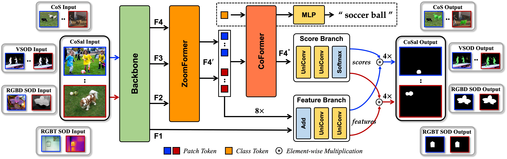

# UniTR: A Unified TRansformer-based Framework for Co-object and Multi-modal Saliency Detection (TMM 2024)

Created by Ruohao Guo, Xianghua Ying*, Yanyu Qi, Liao Qu

This repository contains PyTorch implementation for paper "[UniTR: A Unified TRansformer-based Framework for Co-object and Multi-modal Saliency Detection](https://ieeexplore.ieee.org/abstract/document/10444934)".

In this paper, we develop a Unified TRansformer-based framework, namely UniTR, aiming at tackling the above tasks individually with a unified architecture. Specifically, a transformer module (CoFormer) is introduced to learn the consistency of relevant objects or complementarity from different modalities. To generate high-quality segmentation maps, we adopt a dualstream decoding paradigm that allows the extracted consistent or complementary information to better guide mask prediction. Moreover, a feature fusion module (ZoomFormer) is designed to enhance backbone features and capture multi-granularity and multi-semantic information. Extensive experiments show that our UniTR performs well on 17 benchmarks, and surpasses existing SOTA approaches.

\


## Usage

### Installation

```
conda create -n unitr python=3.8 -y
conda activate unitr
pip install torch==1.11.0 torchvision==0.12.0
pip install timm opencv-python einops
pip install tensorboardX pycocotools imageio scipy moviepy thop
```

### Co-object Saliency Detection

#### Training

- co-segmentation and co-saliency object detection (training data: [COCO2017](https://cocodataset.org/#home)):

```bash
cd ./co_object_saliency_detection
python main.py
```

- video salient object detection (training data: [DAVIS and FBMS](https://drive.google.com/file/d/1LwqQi7axAgQhf3O-wHWj_MkYBEXNn8gQ/view?usp=sharing)):

```bash
cd ./co_object_saliency_detection
python finetune.py
```

#### Inference

- co-segmentation (checkpoint: [unitr_cos_swin.pth](https://drive.google.com/file/d/1-RJRRFUVtgbotJxbMAtaRZKgPWmDorqQ/view?usp=sharing), [unitr_cos_vgg.pth](https://drive.google.com/file/d/1cUcwy-spqwR6yYU0oUo-AoqMK4NiN5y9/view?usp=sharing)):

```bash
cd ./co_object_saliency_detection
python generate_maps_cos.py
```

- co-saliency object detection (checkpoint: [unitr_cosod_swin.pth](https://drive.google.com/file/d/1CjHTeGoJpfeYhBW-a2Dz9EIPkSeQdtj4/view?usp=sharing), [unitr_cosod_vgg.pth](https://drive.google.com/file/d/14mSluZ-D0S1tJuz57M_lijAQCBVW9f9b/view?usp=sharing)):

```bash
cd ./co_object_saliency_detection
python generate_maps_cosod.py
```

- video salient object detection (checkpoint: [unitr_vsod_swin.pth](https://drive.google.com/file/d/1uwgoAUsIFMxYvsMiyWg1_D94CiCwkxpC/view?usp=sharing)):

```bash
cd ./co_object_saliency_detection
python generate_maps_vsod.py
```


#### Evaluation

- co-segmentation (results: [unitr_cos_swin](https://drive.google.com/file/d/1-__5urEP47nH72rzHipaD4BUM2DDPuwC/view?usp=sharing)):

```bash
cd ./co_object_saliency_detection
python generate_maps_cos.py
```

- co-saliency object detection (results: [unitr_cosod_swin](https://drive.google.com/file/d/1GcK4E28F5RH2vfQY48IvDqsjlXTaGB5a/view?usp=sharing), [unitr_cosod_vgg](https://drive.google.com/file/d/1NqKpeKSUrlOeCU_8Q7NJpQojQOdJ4iZv/view?usp=sharing)):

```bash
cd ./co_object_saliency_detection/eval
sh eval_cosod.sh
```

- video salient object detection (results: [unitr_vsod_swin](https://drive.google.com/file/d/1P8pVdsJcunFKEt8wEibhIlRQdrPkwxqP/view?usp=sharing)):

```bash
cd ./co_object_saliency_detection/eval
sh eval_vsod.sh
```


### Multi-modal Saliency Detection

#### Training

- RGB-T salient object detection (training data: [VT5000](https://github.com/lz118/RGBT-Salient-Object-Detection)):

```bash
cd ./multi_modal_saliency_detection/train
python train_rgbt.py
```

- RGB-D salient object detection (training data: [NLPR_NJUD](https://drive.google.com/file/d/1fcJj4aYdJ6N-TvvxSZ_sBo-xhtd_w-eJ/view)):

```bash
cd ./multi_modal_saliency_detection/train
python train_rgbd.py
```

#### Inference

- RGB-T salient object detection (checkpoint: [unitr_rgbt_swin.pth](https://drive.google.com/file/d/1XWl4DFPk4jn9VQZrqx8hPqmAjwk61ibg/view?usp=sharing), [unitr_rgbt_vgg.pth](https://drive.google.com/file/d/10yzbPvLXur4YPngOP_G6mSAGeQEk3nda/view?usp=sharing)):

```bash
cd ./multi_modal_saliency_detection/test
python generate_maps_rgbt.py
```

- RGB-D salient object detection (checkpoint: [unitr_rgbd_swin.pth](https://drive.google.com/file/d/1kD9xTYxv8eeef0bx2B9e_4oNoOg6sHhg/view?usp=sharing), [unitr_rgbd_res.pth](https://drive.google.com/file/d/1lQ9DgnNNqwwjB3aJ1hhGiMdmjA_PvVYu/view?usp=sharing)):

```bash
cd ./multi_modal_saliency_detection/test
python generate_maps_rgbd.py
```

#### Evaluation

- RGB-T salient object detection (results: [unitr_rgbt_swin](https://drive.google.com/file/d/1xYjDy62lPUylRleWwuC4Q19ZGn9Yn9gP/view?usp=sharing), [unitr_rgbt_vgg](https://drive.google.com/file/d/1rVV5bWSt7ZdGwQNzM5F6n6PSWniskiLP/view?usp=sharing):

```bash
cd ./multi_modal_saliency_detection/eval
python eval_rgbt.py
```

- RGB-D salient object detection (results: [unitr_rgbd_swin](https://drive.google.com/file/d/1ZrMZayFJyz7sZb71s7_6MMCMNPc0QDy4/view?usp=sharing), [unitr_rgbd_res](https://drive.google.com/file/d/166l0EPhsVDgO98YjqRAK0UXzMi50lXIJ/view?usp=sharing)):

```bash
cd ./multi_modal_saliency_detection/eval
python eval_rgbd.py
```


## FAQ
If you want to improve the usability or any piece of advice, please feel free to contant directly (ruohguo@foxmail.com).


## Acknowledgement

Thanks [SSNM](https://github.com/cj4L/SSNM-Coseg), [Swin](https://github.com/microsoft/Swin-Transformer), 
[UFO](https://github.com/suyukun666/UFO), and [SwinNet](https://github.com/liuzywen/SwinNet) contribution to the community!


## Citation

Please consider citing our paper in your publications if the project helps your research. BibTeX reference is as follow.

```
@ARTICLE{10444934,
  author={Guo, Ruohao and Ying, Xianghua and Qi, Yanyu and Qu, Liao},
  journal={IEEE Transactions on Multimedia}, 
  title={UniTR: A Unified TRansformer-based Framework for Co-object and Multi-modal Saliency Detection}, 
  year={2024},
  volume={},
  number={},
  pages={1-15},
  doi={10.1109/TMM.2024.3369922}}
```

